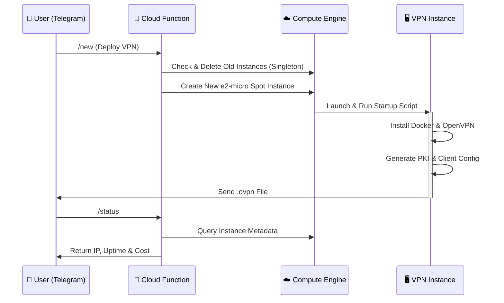
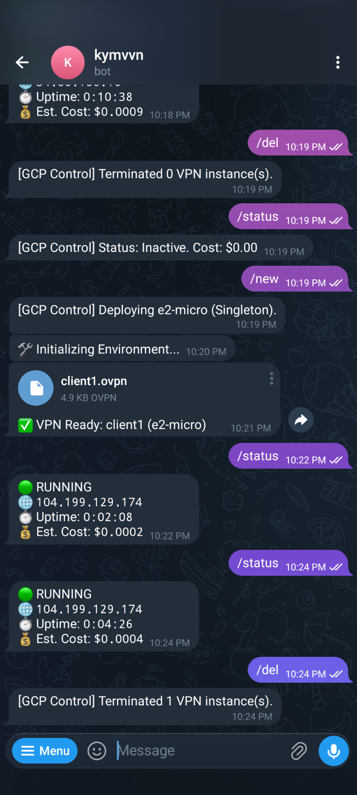

# 🛡️ GCP Serverless Telegram VPN Bot


**Create disposable, cost-effective OpenVPN servers on-demand directly from Telegram.**

Designed for engineers and privacy advocates who need a clean IP address or a secure tunnel temporarily, without the commitment and cost of running a VPS 24/7. This bot leverages Google Cloud Functions and Compute Engine Spot instances to deliver a powerful, serverless VPN solution that costs pennies to run.

---

## 🚀 Key Features

*   **Serverless Architecture**: Logic runs on **Google Cloud Functions (2nd Gen)**. Zero cost when idle.
*   **Singleton Pattern**: Automatically destroys existing instances before creating a new one, preventing accidental billing.
*   **Ultra Low Cost**: Utilizes **Spot Instances (e2-micro)** for maximum savings (~$0.005/hour).
*   **Automated Deployment**: One-click setup via Telegram. Auto-generates OpenVPN (`.ovpn`) configuration and sends it directly to your chat.
*   **Real-time Insights**: Check IP, Uptime, and **Estimated Cost** directly from the bot.

---

## 🛠️ Architecture

The bot follows a serverless event-driven architecture to keep costs minimal.



---

## 📋 Prerequisites

Before you begin, ensure you have the following:

1.  **Google Cloud Platform Account**: With billing enabled.
2.  **Telegram Account**: You'll need a bot token.
3.  **Google Cloud SDK (`gcloud`)**: Installed and authenticated locally (or use Cloud Shell).

---

## ⚙️ Configuration

Create a file named `main.py` in your project root and configure the `CFG` dictionary with your details:

| Key | Description | Example |
| :--- | :--- | :--- |
| `token` | Your Telegram Bot Token from @BotFather | `"123456:ABC-DEF..."` |
| `chat_id` | Your personal Telegram User ID (get from @userinfobot) | `"987654321"` |
| `project` | Your GCP Project ID | `"my-gcp-project"` |
| `zone` | The GCP Zone for the VM | `"us-central1-a"` |
| `prefix` | Name prefix for the VPN instance | `"vpn-svr"` |
| `machine` | The machine type (e2-micro recommended for cost) | `"e2-micro"` |
| `hourly_rate` | Estimated hourly cost for the spot instance | `0.005` |

```python
# main.py configuration block
CFG = {
    "token": "YOUR_TELEGRAM_BOT_TOKEN",
    "chat_id": "YOUR_TELEGRAM_USER_ID",
    "project": "your-gcp-project-id",
    "zone": "asia-east1-c",
    "prefix": "vpn-svr",
    "machine": "e2-micro",
    "hourly_rate": 0.005
}
```

---

## 📦 Deployment Guide

### 1. Enable Required APIs

Run the following commands in your terminal to enable necessary GCP services:

```bash
gcloud services enable \
    cloudfunctions.googleapis.com \
    cloudbuild.googleapis.com \
    compute.googleapis.com \
    run.googleapis.com
```

### 2. Deploy to Cloud Functions

Deploy the bot logic to Google Cloud Functions (Gen 2). Note: We allocate 512MB memory to handle the `google-cloud-compute` library efficiently.

```bash
gcloud functions deploy deploy-vpn \
    --gen2 \
    --runtime=python310 \
    --region=asia-east1 \
    --source=. \
    --entry-point=deploy_vpn \
    --trigger-http \
    --allow-unauthenticated \
    --memory=512MB
```

### 3. Set the Webhook

After deployment, copy the URL from the output (e.g., `https://asia-east1-project.cloudfunctions.net/deploy-vpn`) and register it with Telegram:

```bash
curl "https://api.telegram.org/bot<YOUR_TOKEN>/setWebhook?url=<YOUR_FUNCTION_URL>"
```

---

## 📱 Usage

Once deployed, interact with your bot on Telegram:

### Commands

*   `/new` - **Deploy VPN**: Terminates any existing instance and launches a fresh one. You will receive a `.ovpn` file in ~2 minutes.
*   `/status` - **Check Status**: Displays the current Public IP, Uptime, and Real-time Estimated Cost.
*   `/del` - **Destroy All**: Immediately terminates all VPN instances to stop billing.

### Example Interaction

<p align="center">
  
</p>

---

## 💰 Cost Analysis (Estimated)

*   **Cloud Functions**: The Free Tier covers 2 million invocations per month. **(Free)**
*   **Compute Engine (e2-micro Spot)**:
    *   Approx. **$0.005 USD / hour** (varies by region).
    *   10 hours of usage ≈ **$0.05 USD**.
*   **Network Egress**: Standard GCP rates apply (first 1GB is usually free/month).

**Pro Tip**: Always use `/del` when you're done to ensure zero unexpected costs!

---

## 🔒 Security

*   **Ephemeral Keys**: New PKI and client certificates are generated for every session.
*   **Disposable Infrastructure**: The server is destroyed after use, leaving no trace.
*   **Access Control**: The bot is hardcoded to respond **only** to your specific `chat_id`. Unauthorized users are ignored.

---

## 🤝 Contributing

Contributions are welcome! Please feel free to submit a Pull Request.

1.  Fork the repository
2.  Create your feature branch (`git checkout -b feature/AmazingFeature`)
3.  Commit your changes (`git commit -m 'Add some AmazingFeature'`)
4.  Push to the branch (`git push origin feature/AmazingFeature`)
5.  Open a Pull Request

---

## 📝 License

This project is licensed under the MIT License - see the [LICENSE](LICENSE) file for details.
