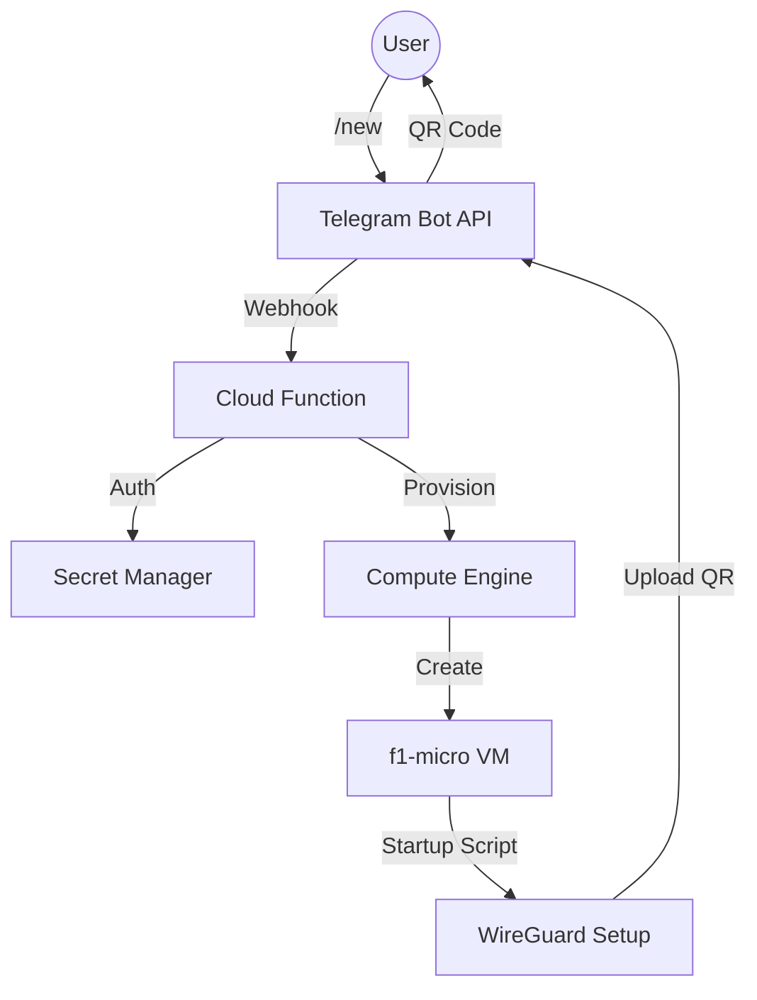

# 🛡️ Serverless WireGuard VPN Bot


A cost-optimized, serverless Telegram Bot that deploys disposable WireGuard VPN servers on Google Cloud Platform (GCP) on-demand. Designed for personal use with extreme cost efficiency using `f1-micro` Spot Instances.

## 🚀 Features

*   **Zero Idle Cost:** Serverless architecture (Cloud Functions 2nd Gen) scales to zero.
*   **Menu-Driven UI:** Interactive Telegram Inline Keyboards for region and peer selection.
*   **Global Reach:** Deploy to any GCP region (Taiwan, Tokyo, US, Europe, etc.).
*   **Instant Access:** Automatically generates WireGuard configs and **QR Codes** sent directly to chat.
*   **Cost Optimized:** Uses Spot `f1-micro` instances (~$0.004/hour) with auto-shutdown capability (manual `/del`).
*   **Multi-User Support:** Strict authorization via Secret Manager (User ID whitelist).
*   **Smart Management:** Tracks active instances, enforces quotas (max 5), and allows 1-click destruction.

## 🏗️ Architecture



## 🛠️ Prerequisites

1.  **Google Cloud Platform Project**: Create a new project.
2.  **Telegram Bot**: Create a bot via [@BotFather](https://t.me/BotFather) and get the token.
3.  **User ID**: Get your numeric Telegram User ID (use [@userinfobot](https://t.me/userinfobot)).

## ⚙️ Configuration (Secrets)

This bot relies on **Google Secret Manager** for security. You must create the following secrets in your GCP project:

| Secret Name | Value Example | Description |
| :--- | :--- | :--- |
| `TELEGRAM_BOT_TOKEN` | `123456:ABC-DEF1234ghIkl-zyx57W2v1u123ew11` | Your Telegram Bot Token. |
| `AUTHORIZED_USER_ID` | `123456789,987654321` | Comma-separated list of allowed User IDs. |

*Note: `GCP_PROJECT_ID` is set as an environment variable during deployment.*

## 🚀 Deployment Guide

### 1. Enable APIs
Run the following commands in Cloud Shell or your local terminal:

```bash
gcloud services enable \
  cloudfunctions.googleapis.com \
  run.googleapis.com \
  artifactregistry.googleapis.com \
  cloudbuild.googleapis.com \
  compute.googleapis.com \
  secretmanager.googleapis.com
```

### 2. Create Secrets
Replace the values with your actual data:

```bash
printf "YOUR_BOT_TOKEN" | gcloud secrets create TELEGRAM_BOT_TOKEN --data-file=-
printf "YOUR_USER_ID" | gcloud secrets create AUTHORIZED_USER_ID --data-file=-
```

### 3. Grant Permissions
The Cloud Function needs permission to access secrets and manage VM instances.

```bash
PROJECT_ID=$(gcloud config get-value project)
PROJECT_NUMBER=$(gcloud projects describe $PROJECT_ID --format="value(projectNumber)")
SERVICE_ACCOUNT="${PROJECT_NUMBER}-compute@developer.gserviceaccount.com"

# Grant Secret Accessor
gcloud projects add-iam-policy-binding $PROJECT_ID \
  --member serviceAccount:$SERVICE_ACCOUNT \
  --role roles/secretmanager.secretAccessor

# Grant Compute Admin (to create/delete VMs)
gcloud projects add-iam-policy-binding $PROJECT_ID \
  --member serviceAccount:$SERVICE_ACCOUNT \
  --role roles/compute.admin
```

### 4. Deploy Cloud Function
Deploy the function using the **2nd Gen** runtime. Replace `YOUR_PROJECT_ID` with your actual project ID.

```bash
gcloud functions deploy vpn-bot \
  --gen2 \
  --runtime=python311 \
  --region=asia-northeast1 \
  --source=. \
  --entry-point=deploy_vpn \
  --trigger-http \
  --allow-unauthenticated \
  --set-env-vars GCP_PROJECT_ID=YOUR_PROJECT_ID \
  --memory=256MB \
  --timeout=60s
```

### 5. Set Telegram Webhook
After deployment, get the **Function URL** (e.g., `https://...run.app`) and register it:

```bash
curl "https://api.telegram.org/bot<YOUR_TOKEN>/setWebhook?url=<YOUR_FUNCTION_URL>"
```

## 📱 Usage

*   `/start` - Welcome message.
*   `/new` - Open the deployment menu (Region -> Peers).
*   `/status` - Show active VPN servers and connection details.
*   `/del` - Destroy all active instances immediately.

---
**Disclaimer:** This project is for educational purposes. Ensure you comply with GCP Terms of Service regarding Spot Instances and Network usage.
