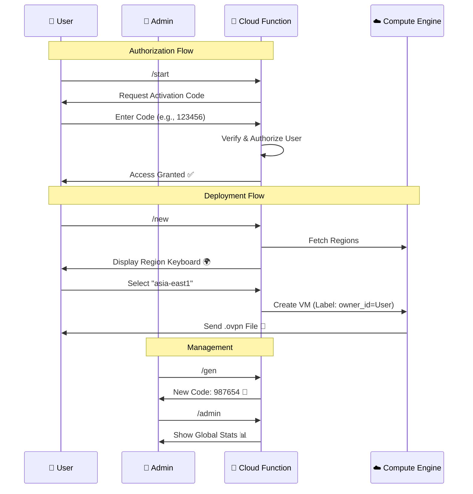

# 🛡️ GCP Serverless Telegram VPN Bot (Multi-User)


**Create disposable, cost-effective OpenVPN servers on-demand directly from Telegram.**

Designed for engineers and privacy advocates who need a clean IP address or a secure tunnel temporarily. This bot leverages Google Cloud Functions and Compute Engine Spot instances to deliver a powerful, serverless VPN solution.

**New Features:**
*   **Multi-User Support**: Share your bot with friends securely.
*   **Activation Codes**: Control access via admin-generated one-time codes.
*   **Dynamic Regions**: Deploy VPNs in *any* available Google Cloud region.
*   **User Quotas**: Limits each user to 5 active VMs to control costs.

---

## 🚀 Key Features

*   **Serverless Architecture**: Logic runs on **Google Cloud Functions (2nd Gen)**. Zero cost when idle.
*   **User Isolation**: Each VM is tagged with the user's ID, ensuring privacy and separate management.
*   **Ultra Low Cost**: Utilizes **Spot Instances (e2-micro)** for maximum savings (~$0.005/hour).
*   **Interactive UI**: Use Telegram Inline Keyboards to browse and select deployment regions.
*   **Admin Dashboard**: Monitor active users, generate codes, and track global usage.

---

## 🛠️ Architecture

The bot follows a serverless event-driven architecture to keep costs minimal.



---

## 📋 Prerequisites

Before you begin, ensure you have the following:

1.  **Google Cloud Platform Account**: With billing enabled.
2.  **Telegram Account**: You'll need a bot token.
3.  **Google Cloud SDK (`gcloud`)**: Installed and authenticated locally (or use Cloud Shell).

---

## ⚙️ Configuration

Create a file named `main.py` in your project root and configure the `CFG` dictionary with your details:

| Key | Description | Example |
| :--- | :--- | :--- |
| `token` | Your Telegram Bot Token from @BotFather | `"123456:ABC-DEF..."` |
| `chat_id` | **Your Admin ID** (get from @userinfobot) | `"987654321"` |
| `project` | Your GCP Project ID | `"my-gcp-project"` |
| `default_zone` | Fallback zone | `"asia-east1-c"` |
| `prefix` | Name prefix for the VPN instance | `"vpn-svr"` |
| `machine` | The machine type (e2-micro recommended) | `"e2-micro"` |

```python
# main.py configuration block
CFG = {
    "token": "YOUR_TELEGRAM_BOT_TOKEN",
    "chat_id": "YOUR_ADMIN_ID",
    "project": "your-gcp-project-id",
    "default_zone": "asia-east1-c",
    "prefix": "vpn-svr",
    "machine": "e2-micro",
    "hourly_rate": 0.005
}
```

---

## 📦 Deployment Guide

### 1. Enable Required APIs

Run the following commands in your terminal to enable necessary GCP services:

```bash
gcloud services enable \
    cloudfunctions.googleapis.com \
    cloudbuild.googleapis.com \
    compute.googleapis.com \
    run.googleapis.com
```

### 2. Deploy to Cloud Functions

Deploy the bot logic to Google Cloud Functions (Gen 2). Note: We allocate 512MB memory to handle the `google-cloud-compute` library efficiently.

```bash
gcloud functions deploy deploy-vpn \
    --gen2 \
    --runtime=python310 \
    --region=asia-east1 \
    --source=. \
    --entry-point=deploy_vpn \
    --trigger-http \
    --allow-unauthenticated \
    --memory=512MB
```

### 3. Set the Webhook

After deployment, copy the URL from the output (e.g., `https://asia-east1-project.cloudfunctions.net/deploy-vpn`) and register it with Telegram:

```bash
curl "https://api.telegram.org/bot<YOUR_TOKEN>/setWebhook?url=<YOUR_FUNCTION_URL>"
```

---

## 📱 Usage

### User Commands
*   `/new` - **Deploy VPN**: Select a region and launch a new instance (Max 5 active).
*   `/status` - **My VMs**: Check IP, Uptime, and Cost of *your* instances.
*   `/del` - **Destroy My VMs**: Terminate all your active instances.

### Admin Commands (Admin Only)
*   `/gen` - **Generate Code**: Create a new 6-digit one-time activation code.
*   `/admin` - **Global Stats**: View total active VMs, list of users, and active codes.

---

## 💰 Cost Analysis (Estimated)

*   **Cloud Functions**: The Free Tier covers 2 million invocations per month. **(Free)**
*   **Compute Engine (e2-micro Spot)**:
    *   Approx. **$0.005 USD / hour** (varies by region).
    *   10 hours of usage ≈ **$0.05 USD**.
*   **Network Egress**: Standard GCP rates apply.

**Pro Tip**: Always use `/del` when you're done to ensure zero unexpected costs!

---

## 🔒 Security

*   **Ephemeral Keys**: New PKI and client certificates are generated for every session.
*   **Access Control**: Users must be authorized via code or be the Admin.
*   **Disposable Infrastructure**: The server is destroyed after use, leaving no trace.

---

## 🤝 Contributing

Contributions are welcome! Please feel free to submit a Pull Request.

---

## 📝 License

This project is licensed under the MIT License - see the [LICENSE](LICENSE) file for details.
