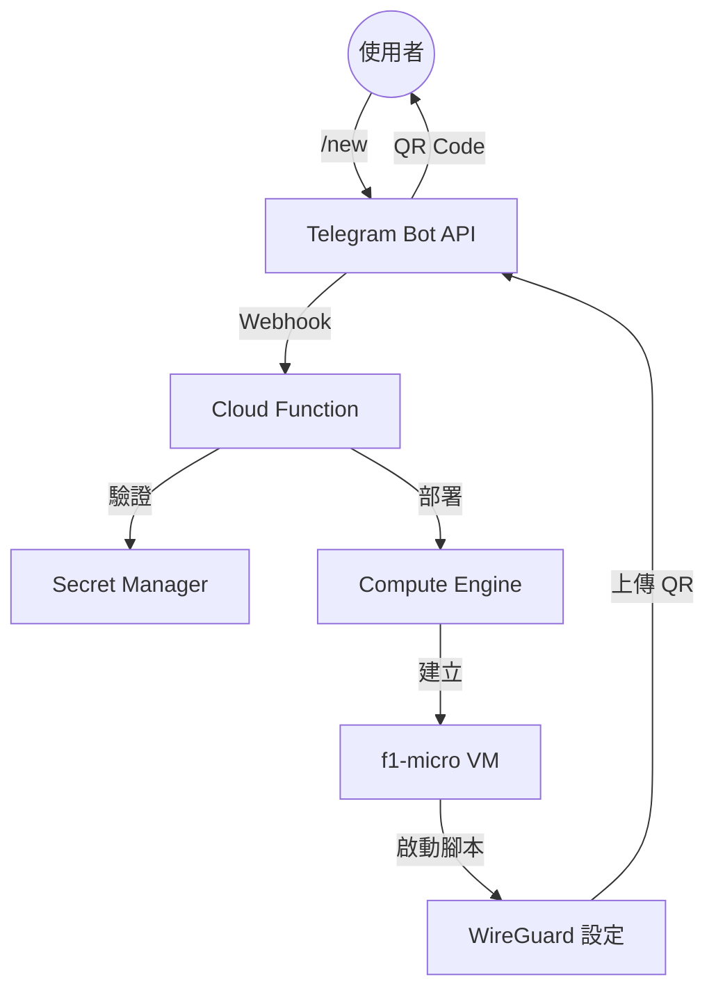

# 🛡️ Serverless WireGuard VPN 機器人

[](https://github.com/your-repo)
[](https://www.python.org/)
[](https://cloud.google.com/)
[](LICENSE)

[**English**](README.md) | [**繁體中文**](README_zh-TW.md)

一個成本優化、Serverless 架構的 Telegram 機器人，可在 Google Cloud Platform (GCP) 上按需部署一次性 WireGuard VPN 伺服器。專為個人使用設計，利用 `f1-micro` Spot 實例實現極致的成本效益。

## 🚀 功能特色

*   **零閒置成本 (Zero Idle Cost):** Serverless 架構 (Cloud Functions 2nd Gen) 在不使用時可縮減至零成本。
*   **選單式介面 (Menu-Driven UI):** 透過 Telegram Inline Keyboard 輕鬆選擇地區與 Peer。
*   **全球部署 (Global Reach):** 支援部署至 **9 個 GCP 地區**，包含台灣、東京、新加坡、美國 (愛荷華、奧勒岡、南卡羅來納)、英國 (倫敦)、德國 (法蘭克福) 及荷蘭。
*   **即時存取 (Instant Access):** 自動產生 WireGuard 設定檔與 **QR Code** 並直接傳送至聊天室。
*   **成本優化 (Cost Optimized):** 使用 Spot `f1-micro` 實例 (約 $0.004/小時)，具備自動關機功能 (手動 `/del`)。
*   **多用戶支援 (Multi-User Support):** 透過 Secret Manager 進行嚴格授權 (User ID 白名單)。
*   **智慧管理 (Smart Management):** 追蹤活躍實例，強制執行配額 (最多 5 個)，並支援一鍵銷毀。

## 🏗️ 架構



## 🛠️ 事前準備

1.  **Google Cloud Platform 專案**: 建立一個新的 GCP 專案。
2.  **Telegram Bot**:透過 [@BotFather](https://t.me/BotFather) 建立機器人並取得 Token。
3.  **User ID**: 取得您的 Telegram User ID (使用 [@userinfobot](https://t.me/userinfobot))。

## ⚙️ 設定 (Secrets)

本機器人依賴 **Google Secret Manager** 確保安全性。您必須在您的 GCP 專案中建立以下 Secrets：

| Secret 名稱 | 值範例 | 說明 |
| :--- | :--- | :--- |
| `TELEGRAM_BOT_TOKEN` | `123456:ABC-DEF1234ghIkl-zyx57W2v1u123ew11` | 您的 Telegram Bot Token。 |
| `AUTHORIZED_USER_ID` | `123456789,987654321` | 允許使用的 User ID 列表 (逗號分隔)。 |

*注意：`GCP_PROJECT_ID` 會在部署時設定為環境變數。*

## 🚀 部署指南

### 1. 啟用 API
在 Cloud Shell 或您的本地終端機執行以下指令：

```bash
gcloud services enable \
  cloudfunctions.googleapis.com \
  run.googleapis.com \
  artifactregistry.googleapis.com \
  cloudbuild.googleapis.com \
  compute.googleapis.com \
  secretmanager.googleapis.com
```

### 2. 建立 Secrets
請將範例值替換為您的實際資料：

```bash
printf "YOUR_BOT_TOKEN" | gcloud secrets create TELEGRAM_BOT_TOKEN --data-file=-
printf "YOUR_USER_ID" | gcloud secrets create AUTHORIZED_USER_ID --data-file=-
```

### 3. 授予權限
Cloud Function 需要存取 Secrets 與管理 VM 實例的權限。

```bash
PROJECT_ID=$(gcloud config get-value project)
PROJECT_NUMBER=$(gcloud projects describe $PROJECT_ID --format="value(projectNumber)")
SERVICE_ACCOUNT="${PROJECT_NUMBER}-compute@developer.gserviceaccount.com"

# 授予 Secret 存取權 (Secret Accessor)
gcloud projects add-iam-policy-binding $PROJECT_ID \
  --member serviceAccount:$SERVICE_ACCOUNT \
  --role roles/secretmanager.secretAccessor

# 授予 Compute 管理權 (Compute Admin) - 用於建立/刪除 VM
gcloud projects add-iam-policy-binding $PROJECT_ID \
  --member serviceAccount:$SERVICE_ACCOUNT \
  --role roles/compute.admin

# 建立防火牆規則 (允許 WireGuard UDP)
gcloud compute firewall-rules create allow-wireguard \
  --direction=INGRESS \
  --priority=1000 \
  --network=default \
  --action=ALLOW \
  --rules=udp:51820 \
  --source-ranges=0.0.0.0/0 \
  --target-tags=vpn-server
```

### 4. 部署 Cloud Function
使用 **2nd Gen** runtime 部署函式。我們使用 `gcloud config get-value project` 自動設定當前的 Project ID。

**注意：** 我們分配 **512MB** 記憶體以防止 Python 載入依賴時發生 Out-Of-Memory 錯誤。

```bash
gcloud functions deploy vpn-bot \
  --gen2 \
  --runtime=python311 \
  --region=asia-northeast1 \
  --source=. \
  --entry-point=deploy_vpn \
  --trigger-http \
  --allow-unauthenticated \
  --set-env-vars GCP_PROJECT_ID=$(gcloud config get-value project) \
  --memory=512MB \
  --timeout=60s
```

### 5. 設定 Telegram Webhook
部署完成後，取得 **Function URL** (例如 `https://...run.app`) 並註冊 Webhook：

```bash
curl "https://api.telegram.org/bot<YOUR_TOKEN>/setWebhook?url=<YOUR_FUNCTION_URL>"
```

## 📱 使用方式

*   `/start` - 歡迎訊息。
*   `/new` - 開啟部署選單 (選擇地區)。
*   `/status` - 顯示活躍的 VPN 伺服器與連線資訊。
*   `/del` - 立即銷毀所有活躍的實例。
*   `/log` - 顯示系統診斷資訊 (Project ID, 活躍 VM 數量等)。

---
**免責聲明：** 本專案僅供教育用途。請確保您遵守 GCP 關於 Spot 實例與網路使用的服務條款。
